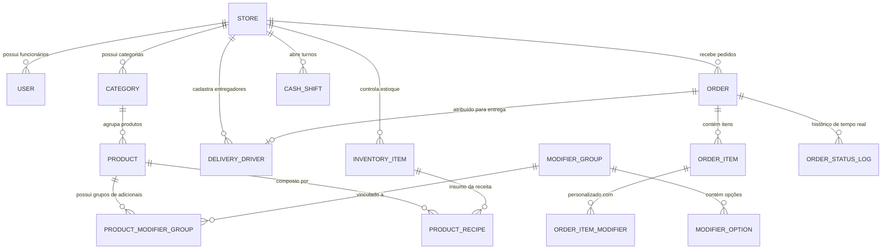

# 🗄️ MODELAGEM DE DADOS RELACIONAL (POSTGRESQL & PRISMA ORM)
## RESHT FOOD SERVICE SUITE — BACKOFFICE & KDS ARCHITECTURE

Esta modelagem relacional em **PostgreSQL / Prisma ORM** foi projetada para suportar alta volumetria de pedidos simultâneos, controle transacional rigoroso de estoque, impressão térmica e sincronização em tempo real via WebSockets.

---

### 1. Diagrama Entidade-Relacionamento (ERD Mermaid)



---

### 2. Prisma Schema (`schema.prisma`)

```prisma
datasource db {
  provider = "postgresql"
  url      = env("DATABASE_URL")
}

generator client {
  provider = "prisma-client-js"
}

enum Role {
  SUPER_ADMIN
  MANAGER
  CASHIER
  KITCHEN
  DRIVER
}

enum OrderStatus {
  RECEIVED
  PREPARING
  READY
  DELIVERING
  DELIVERED
  CANCELLED
}

enum PaymentMethod {
  PIX_ONLINE
  CARD_ONLINE
  CARD_ON_DELIVERY
  CASH
}

enum ModifierType {
  SINGLE_CHOICE   // Obrigatório 1 (ex: Ponto da carne)
  MULTI_CHOICE    // Múltiplos permitidos (ex: Adicionais de queijo, bacon)
  REMOVAL         // Remoções (ex: Sem cebola, Sem picles)
}

// 1. Loja / Restaurante
model Store {
  id              String           @id @default(uuid())
  name            String
  cnpj            String           @unique
  phone           String
  isOpen          Boolean          @default(true)
  avgPrepTimeMin  Int              @default(30)
  createdAt       DateTime         @default(now())
  updatedAt       DateTime         @updatedAt

  users           User[]
  categories      Category[]
  orders          Order[]
  inventoryItems  InventoryItem[]
  cashShifts      CashShift[]
  drivers         DeliveryDriver[]
}

// 2. Usuários e Acessos
model User {
  id        String   @id @default(uuid())
  storeId   String
  name      String
  email     String   @unique
  password  String
  role      Role     @default(CASHIER)
  createdAt DateTime @default(now())

  store     Store    @relation(fields: [storeId], references: [id], onDelete: Cascade)
  shifts    CashShift[]
}

// 3. Cardápio: Categorias e Produtos
model Category {
  id        String    @id @default(uuid())
  storeId   String
  name      String
  sortOrder Int       @default(0)
  active    Boolean   @default(true)
  products  Product[]

  store     Store     @relation(fields: [storeId], references: [id], onDelete: Cascade)
}

model Product {
  id          String    @id @default(uuid())
  categoryId  String
  name        String
  description String?
  basePrice   Decimal   @db.Decimal(10, 2)
  imageUrl    String?
  active      Boolean   @default(true)
  createdAt   DateTime  @default(now())

  category    Category  @relation(fields: [categoryId], references: [id], onDelete: Cascade)
  modifierGroups ProductModifierGroup[]
  recipes     ProductRecipe[]
  orderItems  OrderItem[]
}

// 4. Modificadores e Adicionais (Fast-Food Engine)
model ModifierGroup {
  id          String         @id @default(uuid())
  name        String         // Ex: "Escolha o Ponto", "Turbine seu Burger"
  type        ModifierType   @default(MULTI_CHOICE)
  minSelect   Int            @default(0)
  maxSelect   Int            @default(10)
  options     ModifierOption[]
  products    ProductModifierGroup[]
}

model ProductModifierGroup {
  productId       String
  modifierGroupId String

  product         Product        @relation(fields: [productId], references: [id], onDelete: Cascade)
  modifierGroup   ModifierGroup  @relation(fields: [modifierGroupId], references: [id], onDelete: Cascade)

  @@id([productId, modifierGroupId])
}

model ModifierOption {
  id              String         @id @default(uuid())
  modifierGroupId String
  name            String         // Ex: "Cheddar Extra", "Carne ao Ponto"
  additionalPrice Decimal        @default(0.00) @db.Decimal(10, 2)
  active          Boolean        @default(true)

  modifierGroup   ModifierGroup  @relation(fields: [modifierGroupId], references: [id], onDelete: Cascade)
  orderItemMods   OrderItemModifier[]
}

// 5. Pedidos e Comandas em Tempo Real
model Order {
  id              String           @id @default(uuid())
  storeId         String
  driverId        String?
  orderNumber     String           // Ex: "RST-8492"
  customerName    String
  customerPhone   String
  deliveryAddress String
  deliveryZone    String?
  subtotal        Decimal          @db.Decimal(10, 2)
  deliveryFee     Decimal          @db.Decimal(10, 2)
  discountAmount  Decimal          @default(0.00) @db.Decimal(10, 2)
  totalAmount     Decimal          @db.Decimal(10, 2)
  paymentMethod   PaymentMethod
  paymentStatus   String           @default("PAID") // PAID, PENDING
  changeFor       Decimal?         @db.Decimal(10, 2)
  status          OrderStatus      @default(RECEIVED)
  notes           String?
  createdAt       DateTime         @default(now())
  updatedAt       DateTime         @updatedAt

  store           Store            @relation(fields: [storeId], references: [id], onDelete: Cascade)
  driver          DeliveryDriver?  @relation(fields: [driverId], references: [id])
  items           OrderItem[]
  statusLogs      OrderStatusLog[]
}

model OrderItem {
  id          String               @id @default(uuid())
  orderId     String
  productId   String
  productName String
  unitPrice   Decimal              @db.Decimal(10, 2)
  quantity    Int                  @default(1)
  totalPrice  Decimal              @db.Decimal(10, 2)
  itemNotes   String?

  order       Order                @relation(fields: [orderId], references: [id], onDelete: Cascade)
  product     Product              @relation(fields: [productId], references: [id])
  modifiers   OrderItemModifier[]
}

model OrderItemModifier {
  id                String          @id @default(uuid())
  orderItemId       String
  modifierOptionId  String
  modifierName      String
  additionalPrice   Decimal         @db.Decimal(10, 2)

  orderItem         OrderItem       @relation(fields: [orderItemId], references: [id], onDelete: Cascade)
  modifierOption    ModifierOption  @relation(fields: [modifierOptionId], references: [id])
}

model OrderStatusLog {
  id        String      @id @default(uuid())
  orderId   String
  status    OrderStatus
  timestamp DateTime    @default(now())

  order     Order       @relation(fields: [orderId], references: [id], onDelete: Cascade)
}

// 6. Logística e Entregadores
model DeliveryDriver {
  id              String   @id @default(uuid())
  storeId         String
  name            String
  phone           String
  vehiclePlate    String?
  isOnline        Boolean  @default(true)
  deliveriesCount Int      @default(0)

  store           Store    @relation(fields: [storeId], references: [id], onDelete: Cascade)
  orders          Order[]
}

// 7. Estoque & Insumos com Baixa por Receita
model InventoryItem {
  id              String          @id @default(uuid())
  storeId         String
  name            String          // Ex: "Pão Brioche", "Blend Angus"
  category        String          // Proteínas, Embalagens, etc.
  unit            String          // un, kg, g, l, ml
  currentStock    Decimal         @db.Decimal(10, 2)
  minStockAlert   Decimal         @db.Decimal(10, 2)
  unitCost        Decimal         @db.Decimal(10, 2)
  updatedAt       DateTime        @updatedAt

  store           Store           @relation(fields: [storeId], references: [id], onDelete: Cascade)
  recipeUsages    ProductRecipe[]
}

model ProductRecipe {
  productId       String
  inventoryItemId String
  quantityUsed    Decimal         @db.Decimal(10, 2)

  product         Product         @relation(fields: [productId], references: [id], onDelete: Cascade)
  inventoryItem   InventoryItem   @relation(fields: [inventoryItemId], references: [id], onDelete: Cascade)

  @@id([productId, inventoryItemId])
}

// 8. Frente de Caixa & Fechamento de Turno
model CashShift {
  id              String    @id @default(uuid())
  storeId         String
  userId          String
  openingBalance  Decimal   @db.Decimal(10, 2)
  closingBalance  Decimal?  @db.Decimal(10, 2)
  openedAt        DateTime  @default(now())
  closedAt        DateTime?
  status          String    @default("OPEN") // OPEN, CLOSED

  store           Store     @relation(fields: [storeId], references: [id], onDelete: Cascade)
  user            User      @relation(fields: [userId], references: [id])
}
```

---

### 3. DDL SQL Nativo (PostgreSQL)

```sql
CREATE EXTENSION IF NOT EXISTS "uuid-ossp";

-- Enum Types
CREATE TYPE role_enum AS ENUM ('SUPER_ADMIN', 'MANAGER', 'CASHIER', 'KITCHEN', 'DRIVER');
CREATE TYPE order_status_enum AS ENUM ('RECEIVED', 'PREPARING', 'READY', 'DELIVERING', 'DELIVERED', 'CANCELLED');
CREATE TYPE payment_method_enum AS ENUM ('PIX_ONLINE', 'CARD_ONLINE', 'CARD_ON_DELIVERY', 'CASH');

-- Stores Table
CREATE TABLE stores (
    id UUID PRIMARY KEY DEFAULT uuid_generate_v4(),
    name VARCHAR(255) NOT NULL,
    cnpj VARCHAR(20) UNIQUE NOT NULL,
    phone VARCHAR(30) NOT NULL,
    is_open BOOLEAN DEFAULT TRUE,
    avg_prep_time_min INT DEFAULT 30,
    created_at TIMESTAMP WITH TIME ZONE DEFAULT NOW()
);

-- Orders Table
CREATE TABLE orders (
    id UUID PRIMARY KEY DEFAULT uuid_generate_v4(),
    store_id UUID NOT NULL REFERENCES stores(id) ON DELETE CASCADE,
    order_number VARCHAR(50) NOT NULL,
    customer_name VARCHAR(255) NOT NULL,
    customer_phone VARCHAR(50) NOT NULL,
    delivery_address TEXT NOT NULL,
    subtotal NUMERIC(10, 2) NOT NULL,
    delivery_fee NUMERIC(10, 2) NOT NULL DEFAULT 0.00,
    total_amount NUMERIC(10, 2) NOT NULL,
    payment_method payment_method_enum NOT NULL,
    status order_status_enum DEFAULT 'RECEIVED',
    notes TEXT,
    created_at TIMESTAMP WITH TIME ZONE DEFAULT NOW()
);

-- Order Items
CREATE TABLE order_items (
    id UUID PRIMARY KEY DEFAULT uuid_generate_v4(),
    order_id UUID NOT NULL REFERENCES orders(id) ON DELETE CASCADE,
    product_name VARCHAR(255) NOT NULL,
    unit_price NUMERIC(10, 2) NOT NULL,
    quantity INT NOT NULL DEFAULT 1,
    total_price NUMERIC(10, 2) NOT NULL,
    item_notes TEXT
);

-- Indexes for Ultra Performance
CREATE INDEX idx_orders_status ON orders(status);
CREATE INDEX idx_orders_created_at ON orders(created_at DESC);
CREATE INDEX idx_order_items_order_id ON order_items(order_id);
```
